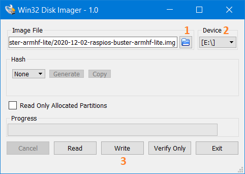

# Configurando seu Raspberry Pi para o desenvolvimento de sistemas embarcados (com foco em IoT)

De forma simplificada, pode-se dizer que sistemas embarcados (ou embutidos) são aqueles que possuem um computador completamente encapsulado e dedicado ao funcionamento do aparato que ele controla. Exemplos: eletrodomésticos; dispositivos de armazenamento como SSDs (_Solid State Drives_) e pen-drives; drones; sistemas de aquisição de dados; entre outros.

Com o advento de diversas ferramentas de desenvolvimento para sistemas embarcados, assim como o Arduino e o Raspberry Pi, as possibilidades de novos e criativos projetos se expandiram consideravelmente. Dessa forma, esse tutorial possui o intuito de auxiliar àqueles que desejam configurar o Raspberry Pi de forma a facilitar o desenvolvimento de sistemas embarcados (incluindo o dispositivos com o conceito de IoT - _Internet of Things_).

## Sumário

- [Configurando seu Raspberry Pi para o desenvolvimento de sistemas embarcados (com foco em IoT)](#configurando-seu-raspberry-pi-para-o-desenvolvimento-de-sistemas-embarcados-com-foco-em-iot)
  - [Sumário](#sumário)
  - [Objetivo](#objetivo)
  - [Requisitos](#requisitos)
  - [Baixando a imagem do Raspberry Pi OS](#baixando-a-imagem-do-raspberry-pi-os)
  - [Gravando a imagem em um _micro SD card_](#gravando-a-imagem-em-um-micro-sd-card)
  - [Configurando SSH](#configurando-ssh)

## Objetivo

O objetivo deste tutorial é ensinar um procedimento para programar o Raspberry Pi remotamente, facilitando o desenvolvimento de sistemas embarcados.

## Requisitos

São requisitos para este tutorial:

- Um __Raspberry pi 3__ (ou superior) ou o __zero w__;
- Um cartão _micro SD_, 8 GB ou maior;
- Fonte de alimentação do _Raspberry Pi_;
- Um computador (_laptop_ ou PC); e
- Conexão com a internet.

## Baixando a imagem do Raspberry Pi OS

Esse tutorial é baseado no _Raspberry Pi OS_. Dessa forma, o primeiro passo é baixar a imagem (arquivo com extensão __img__) do sistema operacional no site oficial. Entre em no endereço:

> [https://www.raspberrypi.org/software/operating-systems/](https://www.raspberrypi.org/software/operating-systems/)
> (acessado em 11/12/2021)

Existirão três opções de download para o _Raspberry Pi OS_:

- _Raspberry Pi OS with desktop and recommended software_ - é a versão mais completa com todos os _softwares_ recomendados já embutidos;
- _Raspberry Pi OS with desktop_ - é a versão básica com a interface de _desktop_ instalada; e
- _Raspberry Pi OS Lite_ - é a versão mais simples sem interface gráfica.

Para a maioria dos projetos a melhor opção é a última (_Raspberry Pi OS Lite_). Por ser a versão mais básica, o desenvolvedor fica livre para escolher o básico que será instalado. No entanto, a escolha da imagem depende da aplicação final do projeto em desenvolvimento. Os procedimentos apresentados aqui funcionam para qualquer uma das opções.

## Gravando a imagem em um _micro SD card_

Enquanto a imagem é baixada, pode-se fazer o _download_ da ferramenta para gravar a imagem no cartão SD. Existem diversos _softwares_ que podem ser utilizados para esta tarefa. No _Windows_, pode-se citar:

- Win32 Disk Imager (https://sourceforge.net/projects/win32diskimager/);
- balenaEtcher (https://www.balena.io/etcher/); 
- Upswift imgFlasher (https://www.upswift.io/imgflasher/)

Os três aplicativos são bem simples e intuitivos de se utilizar. Basicamente, basta selecionar o arquivo da imagem, o cartão SD e clicar no botão de gravação, conforme explicado no [site officinal do projeto Raspberry](https://www.raspberrypi.org/documentation/installation/installing-images/windows.md).

No caso do Win32 Disk Imager, baixe o instalador [clicando aqui](https://sourceforge.net/projects/win32diskimager/), e siga os passos de instalação.

Abra o aplicativo e uma janela igual ao da Figura 1 se abrirá. Primeiro selecione o arquivo da imagem do Raspberry Pi OS clicando no botão indicado como 1. Posteriormente, selecione a unidade onde está inserido o cartão de memória, em 2. Por fim, clique no botão Write (3). O processo de gravação deverá demorar alguns minutos.

|__Figura 1 - Janela do Win32 Disk Imager__|
|---|
||

Ao finalizar a gravação ainda não remova o cartão do computador, pois alguns procedimentos deverão ser feitos, para configurar _Wifi_ e acesso remoto via SSH.

## Configurando SSH

Após a gravação da imagem do sistema operacional no cartão de memória, pode-se habilitar o acesso ao Raspberry PI através de SSH (_Secure Shell_). Para isso, crie um arquivo nomeado hygucomo `ssh` na raiz do cartão de memórica, conforme a Figura 1.