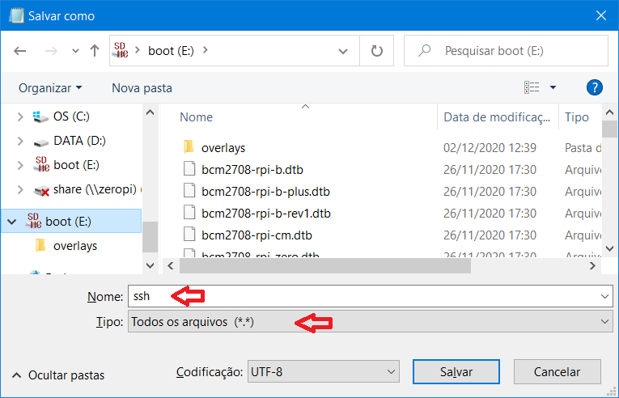
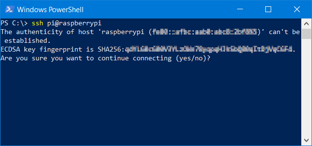

# Configurando seu Raspberry Pi para o desenvolvimento de sistemas embarcados (com foco em IoT)

De forma simplificada, pode-se dizer que sistemas embarcados (ou embutidos) são aqueles que possuem um computador completamente encapsulado e dedicado ao funcionamento do aparato que ele controla. Exemplos: eletrodomésticos; dispositivos de armazenamento como SSDs (_Solid State Drives_) e pen-drives; drones; sistemas de aquisição de dados; entre outros.

Com o advento de diversas ferramentas de desenvolvimento para sistemas embarcados, assim como o Arduino e o Raspberry Pi, as possibilidades de novos e criativos projetos se expandiram consideravelmente. Dessa forma, esse tutorial possui o intuito de auxiliar àqueles que desejam configurar o Raspberry Pi de forma a facilitar o desenvolvimento de sistemas embarcados (incluindo o dispositivos com o conceito de IoT - _Internet of Things_).

## Sumário

- [Configurando seu Raspberry Pi para o desenvolvimento de sistemas embarcados (com foco em IoT)](#configurando-seu-raspberry-pi-para-o-desenvolvimento-de-sistemas-embarcados-com-foco-em-iot)
  - [Sumário](#sumário)
  - [Objetivo](#objetivo)
  - [Requisitos](#requisitos)
  - [Baixando a imagem do Raspberry Pi OS](#baixando-a-imagem-do-raspberry-pi-os)
  - [Gravando a imagem em um _micro SD card_](#gravando-a-imagem-em-um-micro-sd-card)
  - [Configurando _Wifi_ e SSH](#configurando-wifi-e-ssh)
    - [SSH](#ssh)
    - [_Wifi_](#wifi)
  - [Fazendo o primero _boot_ e acessando o terminal remotamente](#fazendo-o-primero-boot-e-acessando-o-terminal-remotamente)
    - [Verificando a conexão](#verificando-a-conexão)
    - [Estabelecendo conexão remota através de SSH](#estabelecendo-conexão-remota-através-de-ssh)
  - [Configurações iniciais](#configurações-iniciais)
    - [Alterando a senha do usuário pi](#alterando-a-senha-do-usuário-pi)
    - [Atualizando o sistema](#atualizando-o-sistema)
    - [O comando `raspi-config`](#o-comando-raspi-config)
  - [Criando uma pasta compartilhada](#criando-uma-pasta-compartilhada)

## Objetivo

O objetivo deste tutorial é ensinar um procedimento para programar o Raspberry Pi remotamente, facilitando o desenvolvimento de sistemas embarcados.

## Requisitos

São requisitos para este tutorial:

- Um __Raspberry pi 3__ (ou superior) ou o __zero w__;
- Um cartão _micro SD_, 8 GB ou maior;
- Fonte de alimentação do _Raspberry Pi_;
- Um computador (_laptop_ ou PC); e
- Conexão com a internet.

## Baixando a imagem do Raspberry Pi OS

Esse tutorial é baseado no _Raspberry Pi OS_. Dessa forma, o primeiro passo é baixar a imagem (arquivo com extensão __img__) do sistema operacional no site oficial. Entre em no endereço:

> [https://www.raspberrypi.org/software/operating-systems/](https://www.raspberrypi.org/software/operating-systems/)
> (acessado em 11/12/2021)

Existirão três opções de download para o _Raspberry Pi OS_:

- _Raspberry Pi OS with desktop and recommended software_ - é a versão mais completa com todos os _softwares_ recomendados já embutidos;
- _Raspberry Pi OS with desktop_ - é a versão básica com a interface de _desktop_ instalada; e
- _Raspberry Pi OS Lite_ - é a versão mais simples sem interface gráfica.

Para a maioria dos projetos a melhor opção é a última (_Raspberry Pi OS Lite_). Por ser a versão mais básica, o desenvolvedor fica livre para escolher o básico que será instalado. No entanto, a escolha da imagem depende da aplicação final do projeto em desenvolvimento. Os procedimentos apresentados aqui funcionam para qualquer uma das opções.

## Gravando a imagem em um _micro SD card_

Enquanto a imagem do _Raspberry Pi OS_ é baixada, pode-se fazer o _download_ da ferramenta para gravar a imagem no cartão SD. Existem diversos _softwares_ que podem ser utilizados para esta tarefa. 

No _Windows_, pode-se citar:

- Win32 Disk Imager (https://sourceforge.net/projects/win32diskimager/);
- balenaEtcher (https://www.balena.io/etcher/); 
- Upswift imgFlasher (https://www.upswift.io/imgflasher/)

Os três aplicativos são bem simples e intuitivos de se utilizar. Basicamente, basta selecionar o arquivo da imagem, o cartão SD e clicar no botão de gravação, conforme explicado no [site officinal do projeto Raspberry](https://www.raspberrypi.org/documentation/installation/installing-images/windows.md).

No caso do Win32 Disk Imager, baixe o instalador [clicando aqui](https://sourceforge.net/projects/win32diskimager/), e siga os passos de instalação.

Abra o aplicativo e uma janela igual ao da Figura 1 se abrirá. Primeiro selecione o arquivo da imagem do _Raspberry Pi OS_ clicando no botão com a imagem de uma pasta (1). Posteriormente, selecione a unidade onde está inserido o cartão de memória (2). Por fim, clique no botão Write (3). O processo de gravação deverá demorar alguns minutos.

|__Figura 1 - Janela do Win32 Disk Imager__|
|---|
||

Ao finalizar a gravação ainda não remova o cartão do computador, pois alguns procedimentos deverão ser feitos, para configurar _Wifi_ e acesso remoto via SSH.

Caso o usuário utilize outro sistema operacional, como o Linux ou Mac OS, pode-se seguir os procedimentos apresentados no próprio site do Raspberry Pi (https://www.raspberrypi.org/documentation/installation/installing-images/).

## Configurando _Wifi_ e SSH

Após a gravação da imagem do sistema operacional no cartão de memória, pode-se habilitar a rede _Wifi_ e o acesso remoto ao Raspberry PI através de SSH (_Secure Shell_). 

### SSH

Crie um arquivo nomeado  `ssh` (sem extensão) na raiz do cartão de memória, conforme a Figura 2. Note que a unidade foi nomeada como `boot`. O arquivo pode ser criado diretamente através do Bloco de Notas do Windows através da opção "Salvar como" e alterando o tipo para "Todos os tipos (\*.\*)", assim como mostra a Figura 3. Atenção: o conteúdo do arquivo deve estar vazio.

|__Figura 2 - Arquivo para habilitar SHH__|
|---|
||

|__Figura 3 - Salvando o arquivo SSH através do bloco de notas__|
|---|
||

### _Wifi_

Abra novamente o bloco de notas, copie e cole o seguinte código:

```
country=BR
ctrl_interface=DIR=/var/run/wpa_supplicant GROUP=netdev
update_config=1
network={
	ssid="nomeWifi"
	psk="senha"
	key_mgmt=WPA-PSK
}
```

Altere: o país (`country`) se for necessário, o nome da rede _Wifi_ em `ssid` e a senha em `psk`. Atenção: mantenha as aspas.

Salve o arquivo na raiz do cartão de memória com o nome `wpa_supplicant.conf`, assim como indicado na Figura 4. 

|__Figura 4 - Salvando o arquivo `wpa_supplicant.conf` através do bloco de notas__|
|---|
||

## Fazendo o primero _boot_ e acessando o terminal remotamente

Insira o cartão de memória no Raspberry Pi e ligue-o à energia através do cabo USB. Não é necessário conectar monitores, teclado ou mouse. Aguarde alguns minutos, até as luzes dos LEDs pararem de piscar.

Certifique-se que seu computador esteja conectado na mesma rede que o Raspberry Pi. No windows abra o Prompt de comando (cmd) ou o Windows PowerShell. Ambos podem ser acessados pressionando Win+R (botão do _Windows_ + a tecla R) e digitando cmd ou PowerShell, respectivamente. 

No Linux ou Mac OS, simplesmente abra o terminal.

### Verificando a conexão

Para verificar se o Raspberry Pi se conectou corretamente na rede _Wifi_ entre com o comando `ping`:

```
ping raspberrypi
```

O resultado do comando no PowerShell do _Windows_ deve ser semelhante à Figura 5. No terminal do Linux pode ser necessário pressionar Ctrl+C para finalizar o comando.

|__Figura 5 - Resultado do comando no PowerShell do *Windows*__|
|---|
||

Basicamente, __ping__ é um comando usado para medir o tempo de resposta da conexão do seu computador com outros dispositivos na rede local ou Internet. O nome `raspberrypi`, que aparece no comando, é o nome de rede (_hostname_) padrão do Raspberry Pi. 

Caso o comando retorne algum erro, recomenda-se procurar o endereço IP do Raspberry Pi. Isso pode ser feito diretamente na página de configurações do roteador ou através de _softwares_, como é o caso do [Adafruit Pi Finder](https://github.com/adafruit/Adafruit-Pi-Finder/releases). Obtendo o endereço IP do dispositivo, repita o comando `ping`, como no exemplo:

```
ping 192.168.1.8
```

O número IP `192.168.1.8` é apenas um exemplo e deve ser substituído pelo endereço encontrado. Caso o Raspberry Pi não seja encontrado na rede, é preciso verificar a configuração de rede ou o arquivo `wpa_supplicant.conf`.

### Estabelecendo conexão remota através de SSH

Finalmente, para estabelecer uma conexão com o Raspberry Pi, entre com o comando `ssh`, utilizando o _hostname_ ou o endereço IP:

```
ssh pi@raspberrypi
```
ou

```
ssh pi@<entre com o IP>
```

Na primeira vez, pode ser necessário aceitar a conexão, assim como mostra a Figura 6. Dessa forma, digite _yes_ e tecle Enter para aceitar.

|__Figura 6 - Primeira conexão__|
|---|
||

Ao aceitar, será pedido a senha do usuário `pi` que, por padrão, é `raspberry`. Entre com a senha e você terá acesso remoto ao sistema Linux do Raspberry Pi OS, assim como pode ser visto na Figura 7.

|__Figura 7 - Acesso remoto ao sistema Linux do Raspberry Pi OS__|
|---|
||

## Configurações iniciais 

O Raspberry Pi OS vem com algumas configurações por padrão e pode ser interessante alterar algumas delas. Primeiramente, é recomendável alterar a senha do sistema.

### Alterando a senha do usuário pi 

É importante alterar a senha do usuário `pi`, pois esta vem por padrão como `raspberry`. Para alterar a senha entre com o seguinte comando:

```
sudo passwd pi
```

Entre com a nova senha duas vezes.

### Atualizando o sistema

É sempre importante atualizar o sistema. Dessa forma, entre com os seguintes comandos na sequência:

```
sudo apt-get dist-upgrade
sudo apt-get update
sudo apt-get upgrade
```

O processo de atualização pode demorar um pouco.

### O comando `raspi-config`

Entre com o seguinte comando para acessar diversas configurações do Raspberry Pi OS:

```
sudo raspi-config
```

O resultado do comando pode ser visto na Figura 8. Nessa ambiente, é possível ajustar diversas configurações. Neste tutorial serão citadas as mais importantes. 

|__Figura 8 - Interface do raspi-config__|
|---|
||

Em _System Options_ é possível: 
- mudar a configuração de _Wifi_ alterando a rede e a senha;
- Ajustar a saída de audio;
- Mudar a senha do usuário `pi` (essa é uma segunda alternativa);
- Mudar o nome de rede, _hostname_, do Raspberry Pi;
- Entre outras opções.

Em _Interface options_, é possível habilitar o acesso remoto de diversos periféricos do Raspberry Pi, como é o caso das portas SPI (_Serial Peripheral Interface_), I2C (_Inter-Integrated Circuit_), GPIO (_General Purpose Input Output_), serial e _1-wire_. Também é uma forma de habilitar o VNC caso queira acessar a área de trabalho remotamente. Dessa forma, o usuário pode habilitar aqui os dispositivos que necessitará em seus projetos.

## Criando uma pasta compartilhada

